# First-Principles Implementation and Validation of an Embedded Inertial MEKF for Tilt Estimation on ESP32 under FreeRTOS

## Acknowledgement
I would like to thank Steven Mitchell of the Maryland Robotics Center at the University of Maryland, College Park, for his guidance and mentorship during the development of this project.

## Abstract
This project implemented and validated a first-principles multiplicative extended Kalman filter (MEKF) for embedded tilt estimation using an LSM6DS33 six-axis gyroscope-accelerometer IMU on a MinIMU-9 v5 breakout board. The filter was implemented in C on an ESP32 under FreeRTOS, with custom firmware modules for IMU register-level interfacing, real-time task scheduling, quaternion-based attitude estimation, covariance propagation, UART logging, and offline Python-based verification. Validation results support that the MEKF correctly estimates roll/pitch tilt, suppresses gyro-integration drift through accelerometer correction, preserves the expected covariance structure, converges to known fixture angles within small mounting error, and degrades in the expected way when the accelerometer’s gravity-only assumption is violated.

## 1. Technical Objective

The objective of this project was to implement, from first principles, an embedded multiplicative extended Kalman filter capable of estimating the angular tilt of an LSM6DS33 IMU using gyroscope and accelerometer measurements. The target platform was an ESP32 running FreeRTOS, with the IMU connected over I2C and logged data transmitted to a PC over UART.
In this project, tilt refers to the observable roll and pitch components of the sensor board’s attitude relative to gravity. Yaw is not directly observable from a gyroscope-accelerometer sensor pair alone because the accelerometer provides a gravity-direction reference but does not constrain rotation about the gravity direction.
The project was intended to demonstrate a complete engineering workflow to move from estimation theory to embedded implementation and physical validation:

* interpreting the MEKF mathematical structure;
* implementing quaternion, matrix, and covariance operations in C;
* writing a register-level IMU driver;
* organizing the firmware under FreeRTOS;
* calibrating the accelerometer;
* characterizing timing and sensor noise behavior;
* validating the estimator using known-angle physical fixtures;
* testing the estimator under a known model-assumption violation.

## 2. Background and Estimation Problem 

A gyroscope measures angular rate. In principle, integrating gyroscope measurements over time can reconstruct orientation. In practice, all gyroscopes exhibit bias and noise, so direct integration accumulates error and causes the estimated attitude to drift.

An accelerometer provides a useful correction signal when the sensor is not undergoing significant translational acceleration. Under static or quasi-static conditions, the accelerometer primarily measures the direction of gravity. That gravity-direction measurement constrains roll and pitch, but not yaw. Therefore, a gyroscope-accelerometer MEKF can estimate tilt reasonably, while yaw remains unobservable without an additional reference such as a magnetometer, camera, or external heading measurement.

The implemented MEKF follows the indirect attitude-filter structure described by Trawny and Roumeliotis in their 2005 University of Minnesota technical report, _Indirect Kalman Filter for 3D Attitude Estimation_. The filter maintains two related states:

1. a _nominal state_, containing the unit quaternion attitude estimate and gyroscope bias estimate;
2. an _error state_, containing a local small-angle attitude error and gyroscope bias error.

This separation is necessary because unit quaternions do not form a vector space. The filter therefore performs additive Kalman filter updates in the local tangent-space error representation, then applies the resulting attitude correction multiplicatively to the nominal quaternion.

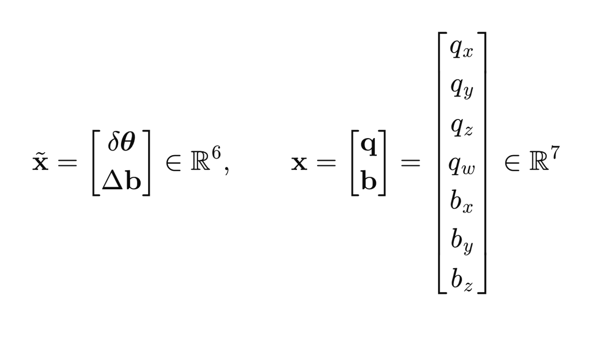

## 3. System Architecture
The project was implemented as an ESP-IDF firmware application running on an ESP32, with a separate set of Python scripts used on the host PC for debugging, verification, and validation. 

On the embedded side, the firmware was divided into three main modules. The IMU driver, `lsm_driver.c`, handled LSM6DS33 configuration, register-level I2C reads, raw-byte interpretation, unit scaling, timestamping, and accelerometer calibration. The filter module, `MEKF.c`, implemented the prediction and correction steps of the multiplicative extended Kalman filter. The supporting math module, `math_lib.c`, provided the matrix, vector, quaternion, and normalization routines needed by the estimator.

At runtime, these modules were coordinated through three FreeRTOS tasks. The IMU polling task periodically checked the LSM6DS33 data-ready status, read fresh gyroscope and accelerometer samples when available, timestamped each measurement, and passed the scaled sample to the estimator through a FreeRTOS queue. The MEKF task consumed these IMU samples, ran the filter prediction and correction logic, and packaged both the final attitude estimate and selected intermediate values for logging. A separate UART logging task then streamed this diagnostic data to the host PC in a CSV-style format for offline analysis.

During initialization, the ESP32 configured the LSM6DS33 for a 208 Hz accelerometer and gyroscope output data rate, a ±245 dps gyroscope full-scale range, and a ±2 g accelerometer full-scale range. The ESP32 communicated with the IMU over I2C and transmitted logged estimator data to the PC through a UART-USB bridge.

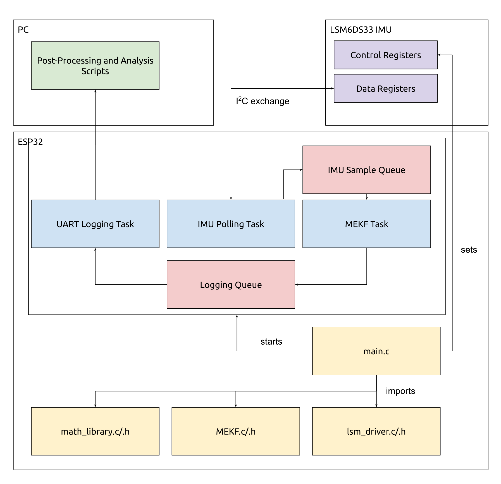

## 4. Sensor Driver Implementation
The LSM6DS33 outputs gyroscope and accelerometer measurements as signed 16-bit values distributed across consecutive output registers. Registers `0x22` through `0x2D` contain the gyroscope and accelerometer output data. Each axis measurement is encoded using two registers: the lower-address register contains the least significant byte, and the next register contains the most significant byte. This is a little-endian layout.

The driver interprets each two-byte pair as a signed two’s-complement `int16_t` value, then converts it into physical units using the sensitivity scale factors corresponding to the configured full-scale ranges. The driver uses a 12-byte burst read to acquire all accelerometer and gyroscope axis measurements in one transaction.

Because the project used a polling-based acquisition scheme rather than FIFO or interrupt-driven sampling, the driver explicitly checked the sensor data-ready status before reading output registers. The polling task invoked a data-ready check, verified that both accelerometer and gyroscope samples were fresh, read the output data, and timestamped the sample using `esp_timer_get_time()`.

## 5. Timing Verification
A key implementation risk in polling-based sensor acquisition is accidentally reading stale data or introducing irregular sample timing. To verify the sampling behavior, the firmware logged thousands of consecutive IMU samples, and the resulting sample-to-sample time intervals were plotted as histograms in Python.

With the IMU output data rate set to 208 Hz, the nominal sensor period is approximately 4.8 ms. When the polling task was configured with a 4 ms period, the expected behavior was that some samples would be acquired after one polling period and some after two polling periods, producing intervals clustered near 4 ms and 8 ms. The observed timing distribution matched this expectation.

When the polling task period was reduced to 1 ms, the observed sample intervals clustered near 4 ms and 5 ms, again consistent with a 208 Hz sensor output rate being observed through a faster polling loop. This supported that the driver was reading fresh measurements rather than repeatedly retrieving the same stale register contents.

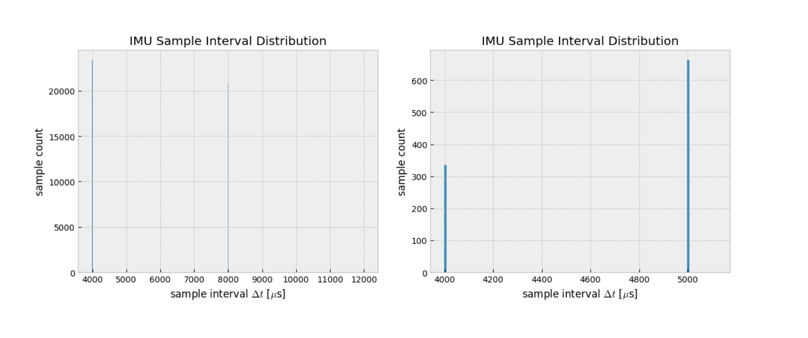

## 6. Embedded Runtime Measurement

To evaluate the computational cost of the estimator, GPIO timing pulses were added around the MEKF prediction step, correction step, and full predict-correct update. These pulses were captured with a logic analyzer using PulseView and exported for offline analysis. Pulse width was used as a direct measurement of firmware execution time.

Across 1058 full-update measurements, the complete MEKF predict-correct update required a mean runtime of 702 us, with a worst observed runtime of 1151 us. Relative to the 4.81 ms sample period corresponding to the 208 Hz IMU output data rate, this represented approximately 14.6% average utilization and 23.9% worst-observed utilization. This supported that the estimator was computationally feasible on the ESP32 and left substantial timing margin for IMU acquisition, logging, and FreeRTOS scheduling.

## 6. Accelerometer Calibration

Accelerometer calibration was required because the MEKF correction step relies on accelerometer measurements to provide a physically meaningful gravity-direction reference. A biased or mis-scaled accelerometer would directly corrupt the measurement update.

The calibration model treated the measured acceleration vector as an affine transformation of the true acceleration vector. In this model, the measurement is related to the true acceleration through a 3-by-3 matrix and a 3-by-1 bias vector. The matrix captures scale, axis coupling, and misalignment effects, while the bias vector captures constant offsets.

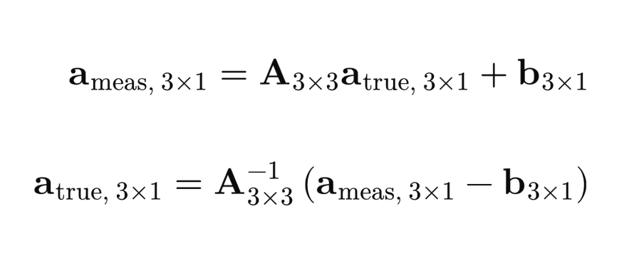

To support calibration, a custom fixture was designed in Autodesk Fusion and printed on a Bambu Labs A1 Mini. The fixture used a ball-and-socket joint and a cube-shaped top that allowed the sensor board to be placed in six mutually orthogonal orientations. A bubble level helped align each pose with the gravity direction.

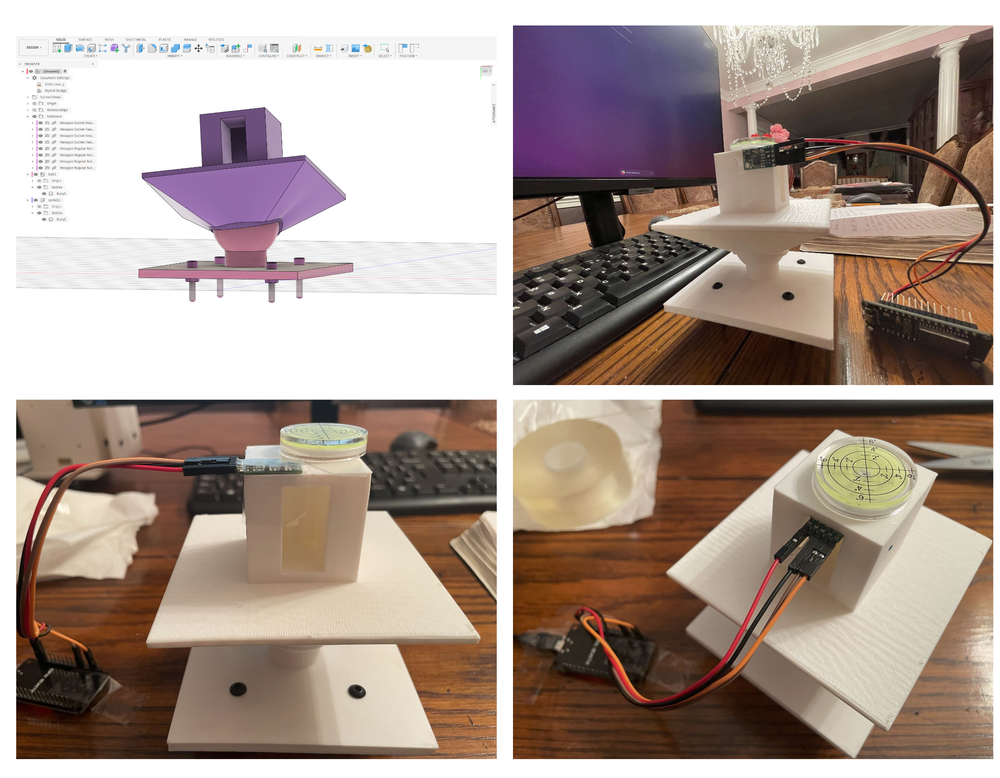

For each of the six calibration poses, approximately 90 seconds of accelerometer data were collected and averaged. These six poses produced 18 scalar equations: three accelerometer axes for each of six orientations. The unknown calibration parameters consisted of the nine entries of the calibration matrix and the three entries of the bias vector, giving 12 unknowns total. The resulting overdetermined system was solved using least-squares regression.

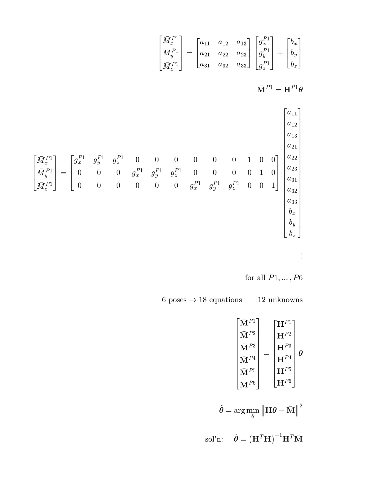

The estimated calibration matrix was close to identity, and the estimated bias vector was small but non-negligible. This was consistent with a plausible accelerometer calibration result. The resulting calibration transform was then implemented directly in the firmware sensor driver.

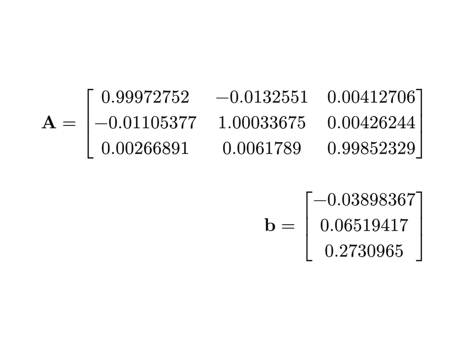

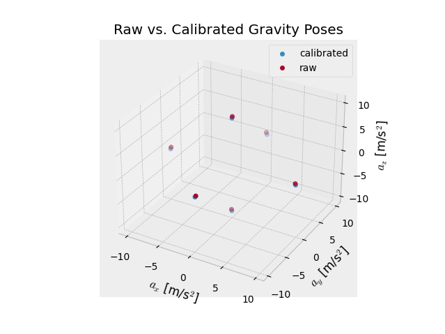

## 7. Gyroscope Noise Characterization 
Kalman filtering assumes stochastic process and measurement noise models. For this project, a stationary gyroscope dataset was collected to examine whether the measured gyroscope behavior was reasonably consistent with the zero-mean Gaussian white-noise assumptions used in the filter design.

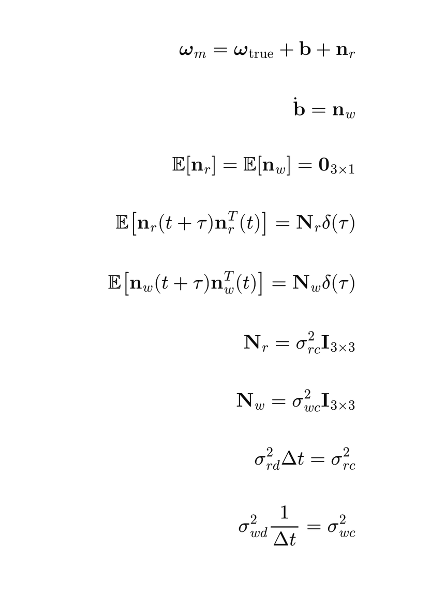

First, several minutes of gyroscope data were collected while the sensor board was held motionless. The sample means were removed, and histograms of the resulting zero-centered measurements were plotted. These distributions appeared approximately bell-shaped and centered near zero, supporting the use of a zero-mean Gaussian approximation for the random component of the gyroscope measurements.

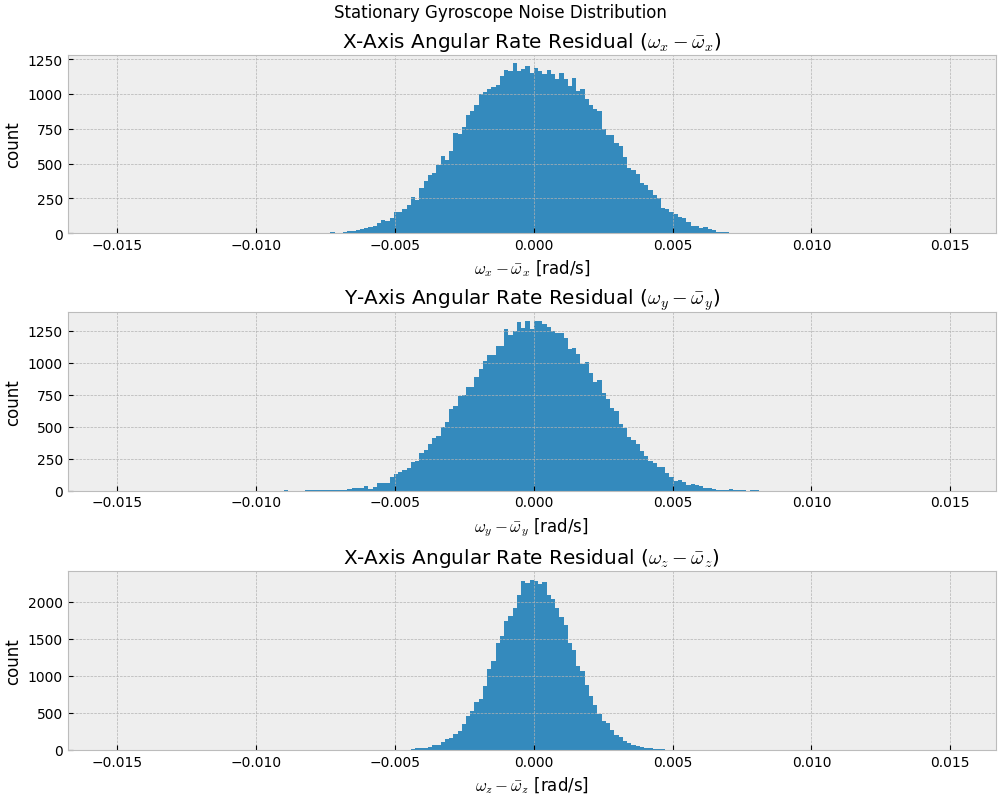

Second, the frequency content of the same mean-subtracted signals was examined. Because the logged IMU samples were not perfectly uniformly spaced in time, a Lomb-Scargle periodogram was used instead of a standard fast Fourier transform. The periodograms showed several peaks, indicating that the measured signal did not behave as purely white noise. These peaks may reflect environmental vibration, electromagnetic interference, mechanical coupling, or other external effects rather than the intrinsic gyroscope noise alone.

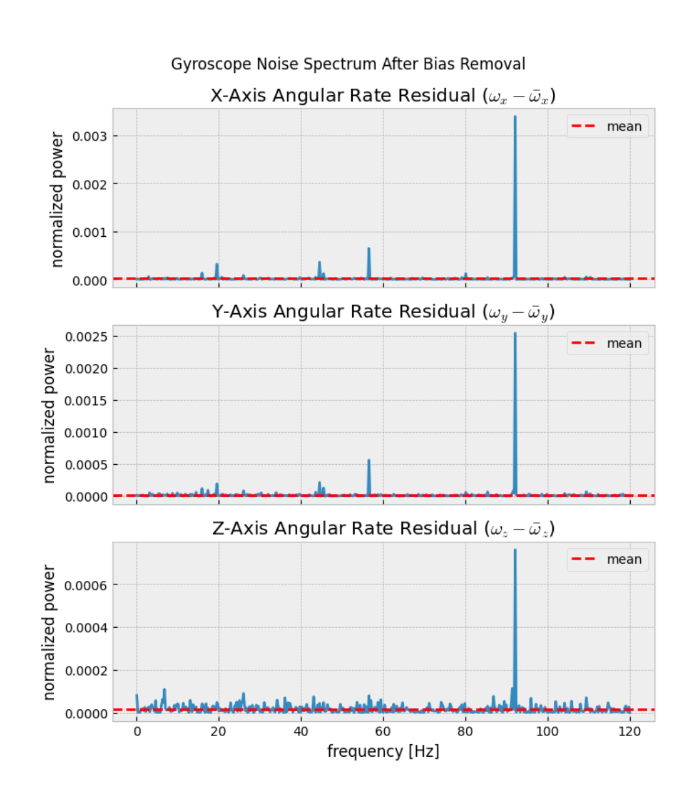

This analysis helped clarify that the process-noise model is an engineering approximation rather than a perfect description of all measured dynamics.

## 8. MEKF Implementation

The MEKF implementation consisted of prediction and correction stages.

During prediction, the filter propagated the nominal quaternion using the latest bias-compensated gyroscope measurement. It also propagated the error-state covariance using the linearized error dynamics and the assumed process-noise model.

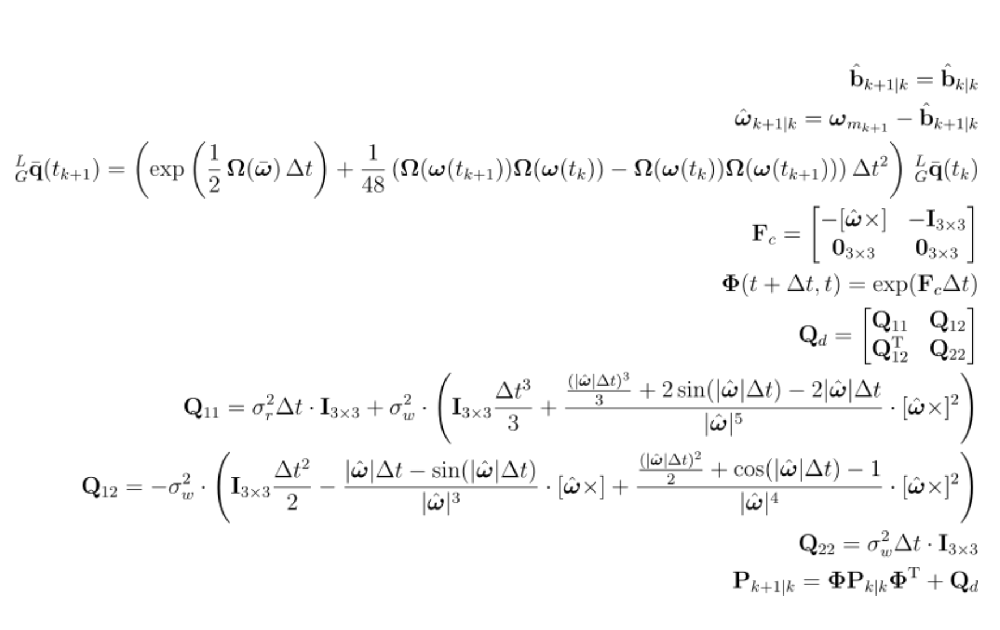

During correction, the filter used the accelerometer measurement as a gravity-direction observation. The correction step computed the expected accelerometer measurement from the current attitude estimate, formed the measurement residual, evaluated the measurement Jacobian, computed the Kalman gain, generated the small-angle error-state correction, applied the quaternion update multiplicatively, updated the gyroscope bias estimate additively, and updated the error-state covariance.

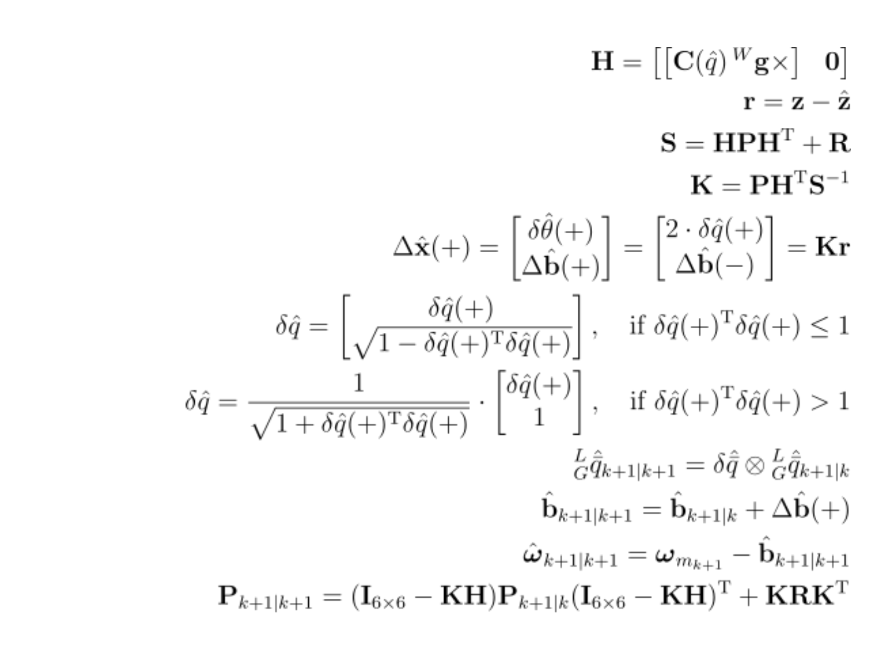

A significant portion of the project involved implementing the supporting numerical operations in C. The custom math library included matrix-vector multiplication, matrix-matrix multiplication, matrix exponential approximation, skew-symmetric cross-product matrix operations, matrix assembly utilities, first-order quaternion integration, quaternion multiplication, quaternion-to-rotation-matrix conversion, vector normalization, and quaternion normalization.

## 9. Physical Test Fixtures

Two physical fixtures were designed and printed: a calibration fixture and a known-angle validation fixture. Both used ball-and-socket mechanisms and M4 fasteners for leveling. The calibration fixture used a cube-shaped top for six-pose accelerometer calibration. The validation fixture used a rectangular sensor mounting bed and a spherical pattern of shallow 2 mm holes spaced approximately 18 degrees apart.

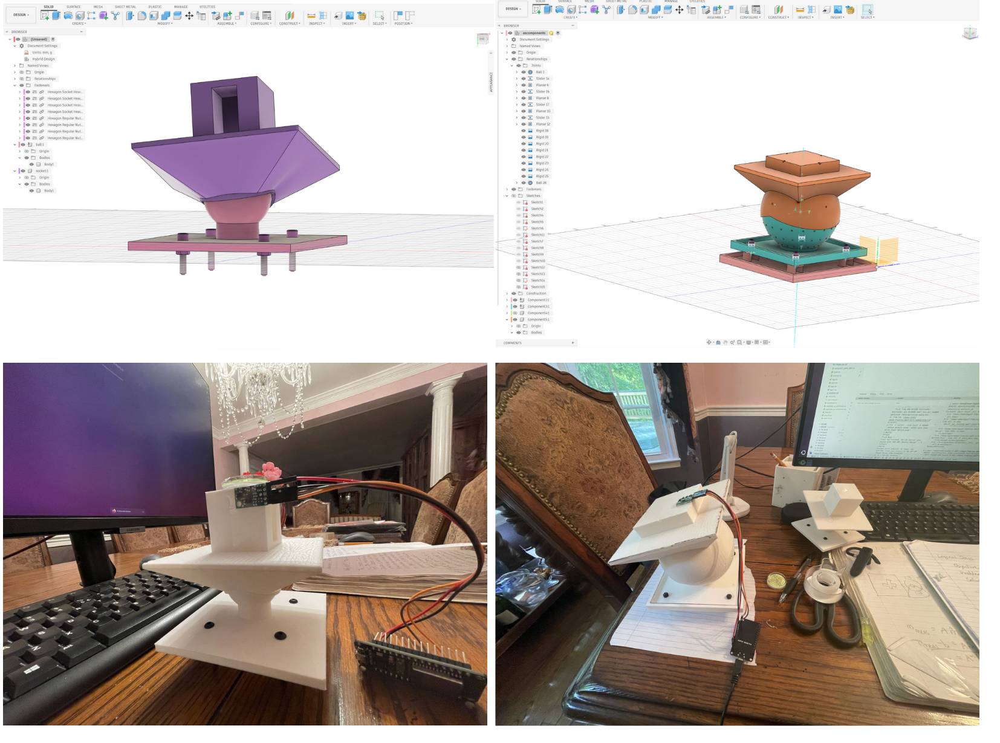

The validation fixture made it possible to place the sensor board at repeatable approximate tilt angles, including 0 degrees, 18 degrees, and 36 degrees. The ball-and-socket interface was designed as a contact-fit joint so that the top fixture component would hold position under its own weight but could still be manually adjusted.

This fixture allowed the filter output to be compared against physical reference angles rather than only against qualitative expectations.

## 10. Validation Tests and Results
### 10.1 Drift Behavior at 0 Degrees
The first validation test placed the sensor board at approximately 0 degrees tilt and logged the attitude estimate over roughly five minutes. Two cases were compared:

1. MEKF correction disabled;
2. MEKF correction enabled.

With correction disabled, the filter reduced to gyroscope propagation, so attitude drift was expected in all three angular degrees of freedom. The logged attitude trajectory showed full 3D drift, consistent with noise-affected gyro integration.

With correction enabled, the accelerometer constrained roll and pitch through the gravity-direction measurement. The resulting attitude trajectory showed that drift was substantially suppressed in tilt, while yaw drift remained. This was the expected result because yaw is not observable from gravity alone.

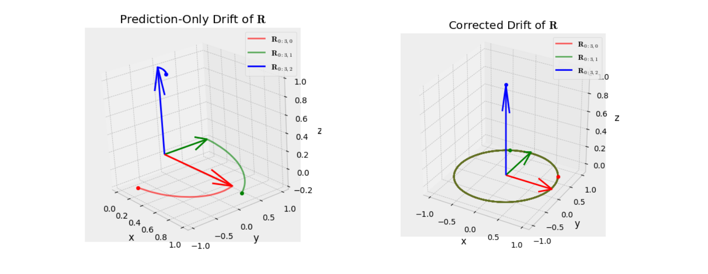

The tilt-angle trajectory also supported the same conclusion. With correction disabled, the estimated tilt drifted. With correction enabled, the estimated tilt remained near 0 degrees, within a small margin attributable to mounting and fixture alignment error.

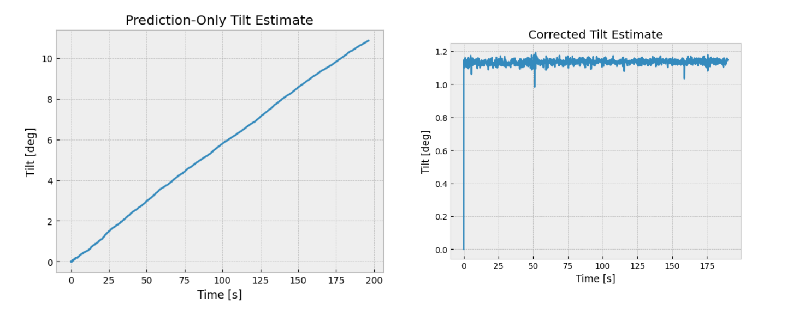

### 10.2 Covariance Trace Behavior
A second validation test examined the time evolution of the error-state covariance trace. The covariance trace is the sum of the variances of the error-state elements, so it provides a scalar indication of total estimated uncertainty.

With correction disabled, the covariance trace grew over time, as expected for gyro-only propagation. With correction enabled, the measurement update reduced the state uncertainty, and the covariance trace remained bounded relative to the propagation-only case.

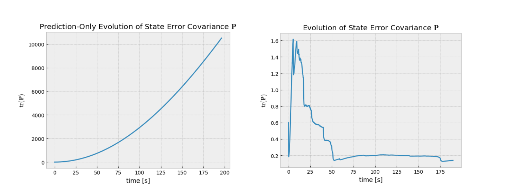

This result supported that the correction step was not only changing the attitude estimate, but also reducing the filter’s internal uncertainty in the expected way.

### 10.3 Covariance Symmetry and Definiteness
A third validation test examined whether the MEKF preserved the expected mathematical structure of the covariance matrices it recursively updated. In theory, all covariance matrices should remain symmetric. The error-state covariance matrix and discretized process-noise covariance matrix should also remain positive semi-definite, while the innovation covariance matrix should remain positive definite.

To test this, covariance matrices were logged for over 100 seconds under both correction-disabled and correction-enabled conditions while the sensor board remained stationary and level. Offline analysis checked eigenvalue behavior over time and quantified symmetry preservation using the relative Frobenius-norm symmetry error, where values near zero indicate that the asymmetric component of the matrix is small relative to the overall matrix magnitude.

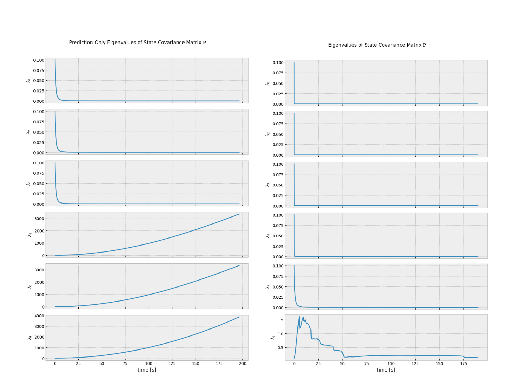

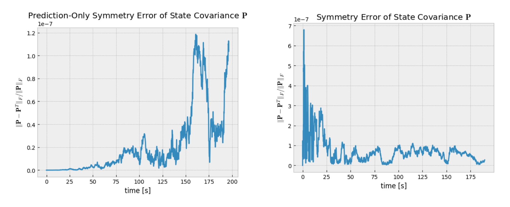

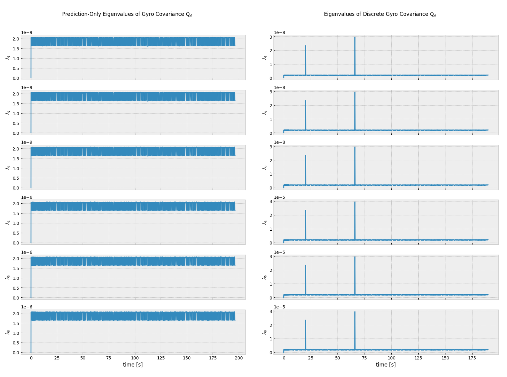

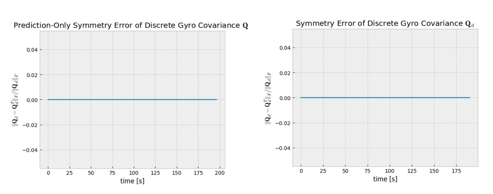

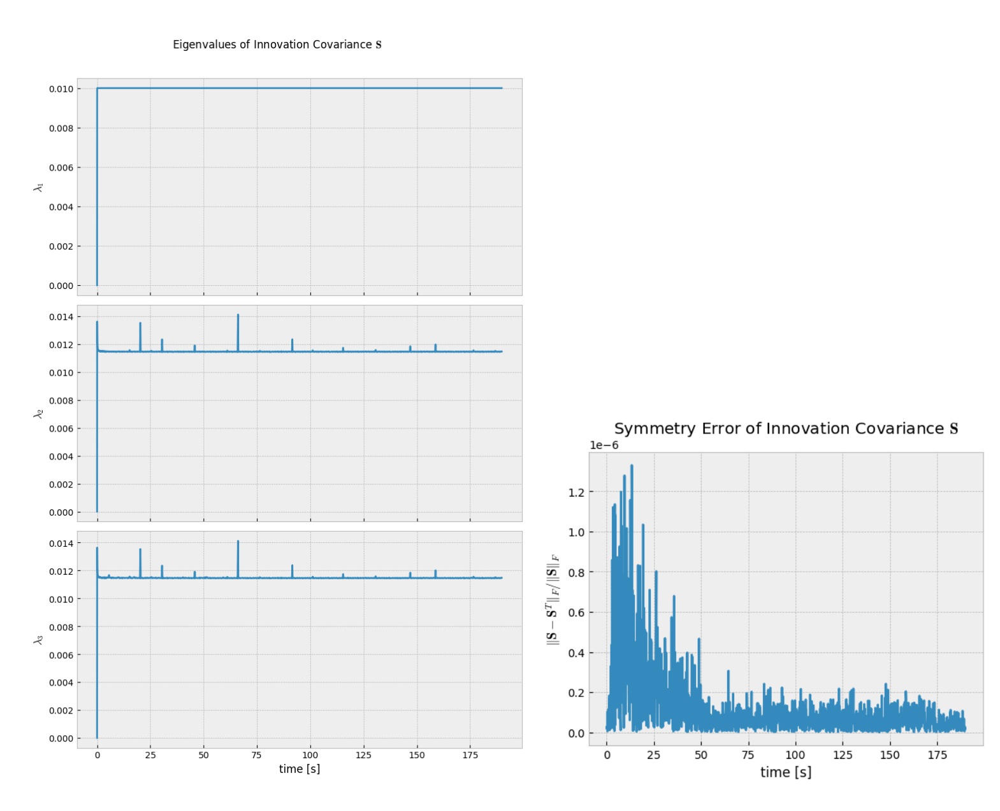

The resulting symmetry-error ratios remained very small, supporting that the covariance matrices preserved symmetry up to floating-point numerical error. Eigenvalue checks further supported that the relevant matrices preserved their expected definiteness properties. This was an important implementation check because covariance-structure errors can indicate numerical instability, incorrect matrix assembly, sign errors, or inconsistent linearization.

### 10.4 Measurement Residual Behavior
The correction step was also evaluated by examining the accelerometer measurement residual. The residual represents the difference between the accelerometer measurement predicted from the current attitude estimate and the accelerometer measurement actually observed by the sensor.

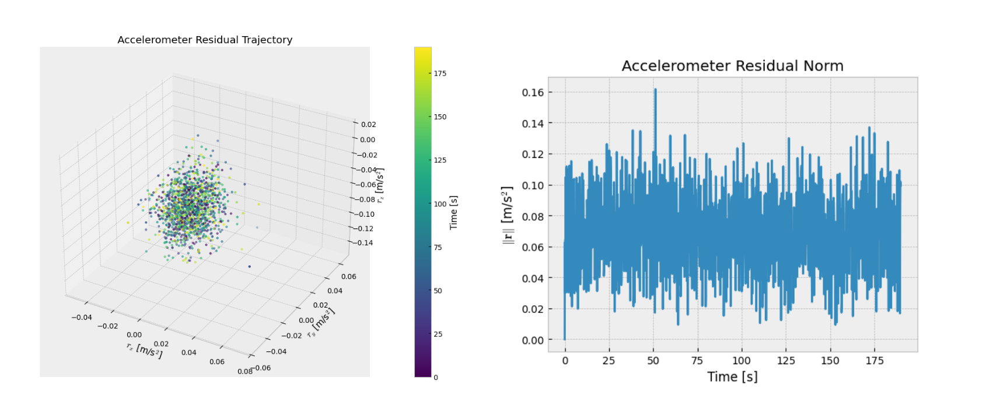

With the sensor held stationary and level, the correction-enabled MEKF maintained a small residual. This supported that the estimated attitude was consistent with the accelerometer gravity-direction measurement under static conditions.

### 10.5 Known-Angle Validation at 18 and 36 Degrees
The known-angle fixture was then used to test whether the filter converged to physically imposed tilt angles. The sensor board was positioned at approximately 18 degrees and 36 degrees of tilt, and the logged MEKF output was compared against those expected values.
For both cases, the filter converged quickly to the expected tilt angle within a small margin of error. The remaining error was attributable to fixture alignment, sensor mounting tolerances, and the limited mechanical precision of the 3D-printed angle indexing system.

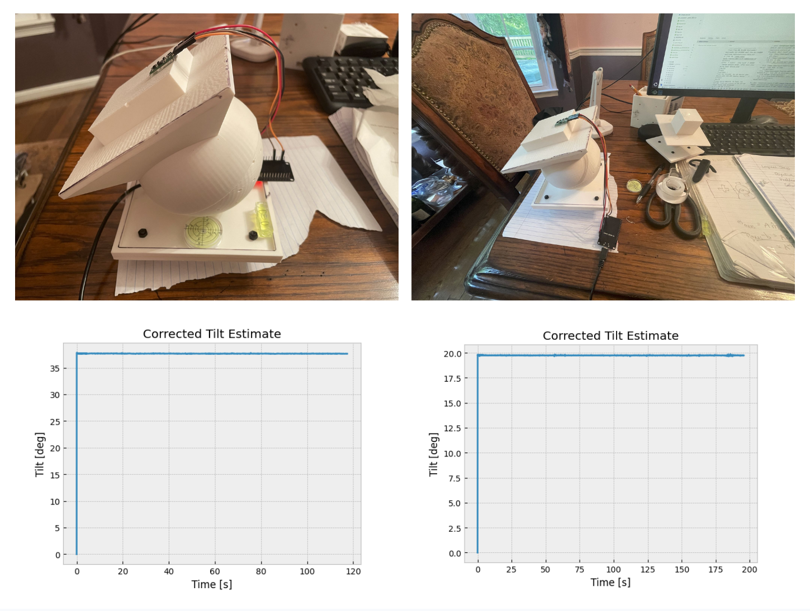

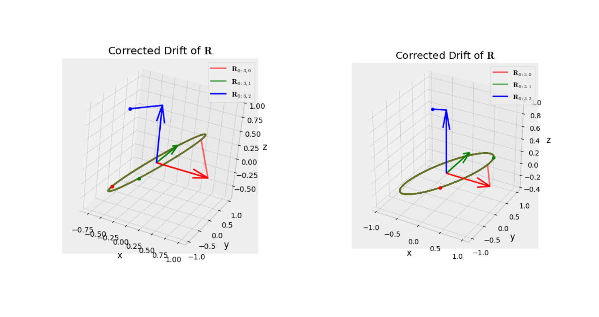

As in the 0-degree case, the results showed that roll/pitch tilt was constrained while yaw remained free to drift, which is the expected observability behavior for a gyroscope-accelerometer estimator.

### 10.6 Translational-Acceleration Failure-Mode Test
A known limitation of a gyroscope-accelerometer MEKF is that the accelerometer correction assumes the accelerometer primarily measures gravity. Significant translational acceleration violates this assumption. If the accelerometer is strongly accelerated linearly, the measured acceleration vector no longer points cleanly along gravity, and the filter may incorrectly interpret translational acceleration as a change in tilt.

To test this failure mode, a prismatic-joint drop-tower mechanism was designed and 3D printed. The sensor board was mounted to the moving portion of the mechanism and translated vigorously up and down while the board’s angular orientation remained approximately fixed.

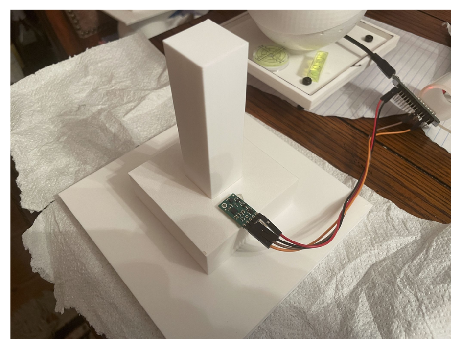

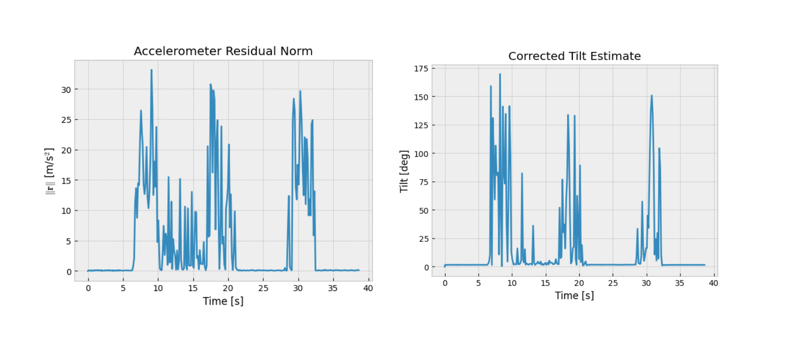

During vigorous translational acceleration, the attitude estimate degraded, as expected. Once the translational disturbance stopped, the tilt estimate returned to approximately 0 degrees. This supports that the filter is sensitive to non-gravitational acceleration during shaking but can recover once the accelerometer measurement again provides a reliable gravity-direction reference.

## 11. Main Result
The implemented embedded MEKF successfully estimated LSM6DS33 tilt on an ESP32 under FreeRTOS. The validation tests support that accelerometer correction suppresses roll/pitch drift, yaw remains unobservable as expected, covariance matrices preserve the expected symmetry and definiteness properties, measurement residuals remain small under static conditions, and the filter converges to known 0-degree, 18-degree, and 36-degree fixture angles within small mechanical alignment error.

The translational-acceleration test further confirmed that the estimator degrades when the accelerometer’s gravity-only measurement assumption is violated and recovers when the disturbance ends. This behavior is consistent with the theoretical limitations of a gyroscope-accelerometer tilt estimator.

## 12. Limitations
The validation process was sufficient to support basic correctness, but it was not exhaustive. The known-angle fixture provided discrete approximate angle references, but it did not provide high-precision ground truth. The test angles were limited to a small number of manually selected positions. The polling-based acquisition scheme introduced timestamp irregularity, and timestamps were assigned at sample retrieval rather than at the exact sensor measurement instant. The gyroscope noise characterization also showed spectral peaks, indicating that the real sensor process was not perfectly modeled as white noise.

Additionally, because the estimator used only gyroscope and accelerometer measurements, yaw was fundamentally unobservable. The project therefore validated tilt estimation rather than full 3D attitude estimation with absolute heading.

## 13. Future Work
Future work should extend the validation process to a larger set of known tilt angles and quantify error across angle, time, and tuning-parameter regimes. The polling-based sensor acquisition system should be replaced with a FIFO-based or interrupt-driven scheme so that timestamps more closely correspond to actual sensor measurement times. Filter tuning should also be evaluated under varying levels of translational acceleration, especially in regimes where non-gravitational acceleration becomes comparable to gravity.
A third sensing modality could also be added to constrain yaw. A magnetometer would provide a heading reference in environments where magnetic interference is sufficiently low, while a camera-based reference system could provide heading information without relying on the local magnetic field.

## 14. Conclusion
This project demonstrated a complete embedded estimation workflow that included first-principles MEKF implementation, register-level IMU interfacing, RTOS task organization, accelerometer calibration, timing and noise analysis, internal covariance verification, physical fixture design, known-angle validation, and failure-mode testing. The resulting system correctly estimated roll/pitch tilt under static conditions and behaved consistently with the theoretical observability and model-assumption limits of a gyroscope-accelerometer MEKF.

## 15. Addenda
### 15.1 Embedded Runtime Measurement

After the main validation work, estimator runtime was measured by capturing GPIO timing pulses with a logic analyzer and PulseView. Separate captures were taken for the MEKF prediction step, correction step, and full predict-correct update, allowing the individual stages and complete estimator update to be compared.

The full MEKF update was the primary real-time feasibility measurement. Across 1058 full-update measurements, the complete predict-correct update required a mean runtime of 702 us and a maximum observed runtime of 1151 us, consuming 14.6% and 23.9% of the 4.81 ms sample period respectively. This supported that the estimator was computationally feasible on the ESP32 at the configured 208 Hz IMU output rate.

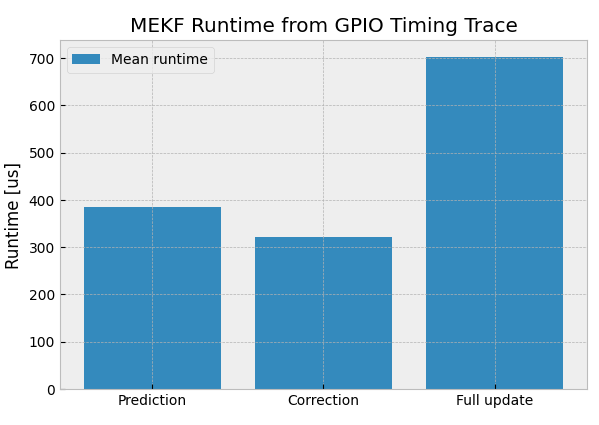
