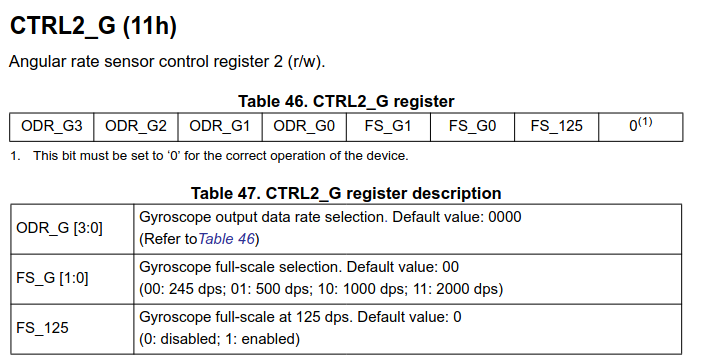
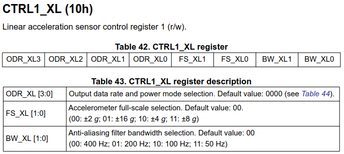
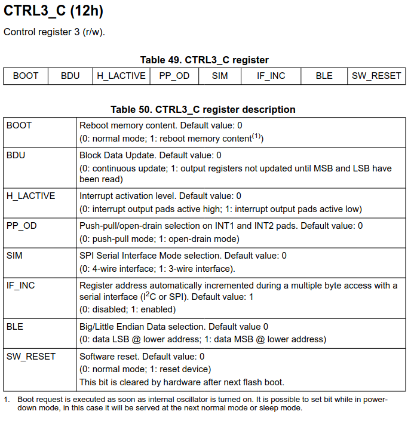

# ESP32 FreeRTOS Implementation of MEKF-Based Tilt Estimation Using the LSM6DS33 IMU

## Wiring the Physical Jumper Wires
I connect the MinIMU-9 v5 to the ESP32 using four jumper wires: two for power and ground, and two for the SDA and SCL lines of the I2C connection. For SDA, I use ESP32's GPIO21--for SCL, 22. I configure ESP-IDF's `menuconfig` project configuration tool to reflect that. Since the ESP32 uses 3.3 V logic, I connect the ESP32 3.3 V rail (not the 5 V rail) to the MinIMU-9 v5. These connections serve to supply the power to the LSM6DS333 and serve to enable the ESP32 to configure, write, and write LSM6DS33 control and data registers.  


## Configuring the Peripherals

### Configuring the I2C Peripheral
I configure the ESP32 I2C master bus and attach one device to that bus to represent the LSM6DS33. 
``` c
static void i2c_master_init(i2c_master_bus_handle_t *bus_handle, i2c_master_dev_handle_t *dev_handle)
{
    i2c_master_bus_config_t bus_config = {
        .i2c_port = I2C_MASTER_NUM,
        .sda_io_num = I2C_MASTER_SDA_IO,
        .scl_io_num = I2C_MASTER_SCL_IO,
        .clk_source = I2C_CLK_SRC_DEFAULT,
        .glitch_ignore_cnt = 7,
        .flags.enable_internal_pullup = true,
    };
    ESP_ERROR_CHECK(i2c_new_master_bus(&bus_config, bus_handle));

    i2c_device_config_t dev_config = {
        .dev_addr_length = I2C_ADDR_BIT_LEN_7,
        .device_address = LSM6DS33_SENSOR_ADDR,
        .scl_speed_hz = I2C_MASTER_FREQ_HZ,
    };
    ESP_ERROR_CHECK(i2c_master_bus_add_device(*bus_handle, &dev_config, dev_handle));
}
```
## Implementing I2C Read and Write Functions
```c
static esp_err_t lsm6ds33_register_read(i2c_master_dev_handle_t dev_handle, uint8_t reg_addr, uint8_t *data, size_t len)
{
    return i2c_master_transmit_receive(dev_handle, &reg_addr, 1, data, len, I2C_MASTER_TIMEOUT_MS / portTICK_PERIOD_MS);
}

static esp_err_t lsm6ds33_register_write_byte(i2c_master_dev_handle_t dev_handle, uint8_t reg_addr, uint8_t data)
{
    uint8_t write_buf[2] = {reg_addr, data};
    return i2c_master_transmit(dev_handle, write_buf, sizeof(write_buf), I2C_MASTER_TIMEOUT_MS / portTICK_PERIOD_MS);
}

```

## Configuring the IMU

### Confirming the Sensor Identity
```c
    ESP_ERROR_CHECK(lsm6ds33_register_read(dev_handle, LSM6DS33_WHO_AM_I_REG_ADDR, data, 1));
    ESP_LOGI(TAG, "WHO_AM_I = 0x%02X (expected 0x%02X)", data[0], LSM6DS33_WHO_AM_I_VALUE);
```
### Configuring the Output Data Rates (ODRs) and Full-Scale Ranges (FSRs)

#### Configuring the Gyroscope ODR and FSR
I configure the gyroscope with a 208 Hz ODR and  245 dps by writing `0x50` (`0101 0000`) to CTRL3_C.  



```c
    ESP_ERROR_CHECK(lsm6ds33_register_write_byte(dev_handle, LSM6DS33_CTRL2_G, LSM6DS33_CTRL2_G_CONFIG));
    ESP_ERROR_CHECK(lsm6ds33_register_read(dev_handle, LSM6DS33_CTRL2_G, data, 1));
    ESP_LOGI(TAG, "CTRL2_G = 0x%02X (expected 0x%02X)", data[0], LSM6DS33_CTRL2_G_CONFIG);
```
#### Configuring the Accelerometer ODR and FSR
I configure the accelerometer with a ±2g FSR, 208 Hz ODR, and 50 Hz alti-aliasing filter bandwidth by writing 0x53 to the CTRL1_XL register. In binary, `0x53` is `0101 0011`.



```c
    ESP_ERROR_CHECK(lsm6ds33_register_write_byte(dev_handle, LSM6DS33_CTRL1_XL, LSM6DS33_CTRL1_XL_CONFIG));
    ESP_ERROR_CHECK(lsm6ds33_register_read(dev_handle, LSM6DS33_CTRL1_XL, data, 1));
    ESP_LOGI(TAG, "CTRL1_XL = 0x%02X (expected 0x%02X)", data[0], LSM6DS33_CTRL1_XL_CONFIG);
```

### Enabling Block Data Update and Register Auto-Increment



```c
    ESP_ERROR_CHECK(lsm6ds33_register_write_byte(dev_handle, LSM6DS33_CTRL3_C, LSM6DS33_CTRL3_C_CONFIG));
    ESP_ERROR_CHECK(lsm6ds33_register_read(dev_handle, LSM6DS33_CTRL3_C, data, 1));
    ESP_LOGI(TAG, "CTRL3_C = 0x%02X (expected 0x%02X)", data[0], LSM6DS33_CTRL3_C_CONFIG);
```

### Verifying Accelerometer and Gyroscope Output
```c
    uint8_t s_buf[12];
    ESP_ERROR_CHECK(lsm6ds33_register_read(dev_handle, LSM6DS33_OUTX_L_G, s_buf, sizeof(s_buf)));
    int16_t gx = (int16_t)((s_buf[1] << 8 | s_buf[0]));
    int16_t gy = (int16_t)((s_buf[3] << 8 | s_buf[2]));
    int16_t gz = (int16_t)((s_buf[5] << 8 | s_buf[4]));
    int16_t ax = (int16_t)((s_buf[7] << 8 | s_buf[6]));
    int16_t ay = (int16_t)((s_buf[9] << 8 | s_buf[8]));
    int16_t az = (int16_t)((s_buf[11] << 8 | s_buf[10]));
    
    ESP_LOGI(TAG, "RAW gx=%d, gy=%d, gz=%d, ax=%d, ay=%d, az=%d", gx, gy, gz, ax,ay, az);
```
## Architecting the RTOS

### Defining the Data Structures


#### Defining a Data Structure for IMU Samples
```c
typedef struct {
    int64_t t_us;
    int16_t ax_raw;
    int16_t ay_raw;
    int16_t az_raw;
    int16_t gx_raw;
    int16_t gy_raw;
    int16_t gz_raw;
} imu_sample_t;

```
### Defining the Queues
#### Defining an IMU Sample Queue

```c
s_imu_q = xQueueCreate(1, sizeof(imu_sample_t)); 
```

### Defining the Tasks
#### Defining the IMU Task
```c
    TaskHandle_t imu_task_handle = NULL; 
    BaseType_t rc = xTaskCreate(
        imu_poll_task,
        "imu_poll_task",
        4096,
        (void*)dev_handle,
        8,
        &imu_task_handle
    );
```

```c
static void imu_poll_task(void *pvParameters){

    i2c_master_dev_handle_t dev_handle = (i2c_master_dev_handle_t)pvParameters;

    const TickType_t period = pdMS_TO_TICKS(5);      //200hz
    TickType_t last_wake = xTaskGetTickCount(); 

    for(;;){
        static uint32_t log_div = 0;

        imu_sample_t sample = {0}; 
        uint8_t s_buf[12];

        esp_err_t err = lsm6ds33_register_read(dev_handle, LSM6DS33_OUTX_L_G, s_buf, sizeof(s_buf));
        if (err != ESP_OK){
            ESP_LOGW(TAG, "IMU read failed: %s", esp_err_to_name(err));
            vTaskDelayUntil(&last_wake, period);
            continue;
        }
        sample.gx_raw = (int16_t)((s_buf[1] << 8 | s_buf[0]));
        sample.gy_raw = (int16_t)((s_buf[3] << 8 | s_buf[2]));
        sample.gz_raw = (int16_t)((s_buf[5] << 8 | s_buf[4]));
        sample.ax_raw = (int16_t)((s_buf[7] << 8 | s_buf[6]));
        sample.ay_raw = (int16_t)((s_buf[9] << 8 | s_buf[8]));
        sample.az_raw = (int16_t)((s_buf[11] << 8 | s_buf[10]));

        sample.t_us = esp_timer_get_time();

        if ((++log_div %20 ) == 0){
            ESP_LOGI(TAG, "RAW gx=%d, gy=%d, gz=%d, ax=%d, ay=%d, az=%d", sample.gx_raw, 
                sample.gy_raw, sample.gz_raw, sample.ax_raw, sample.ay_raw, sample.az_raw);

        }

        vTaskDelayUntil(&last_wake, period);
    }
}
```